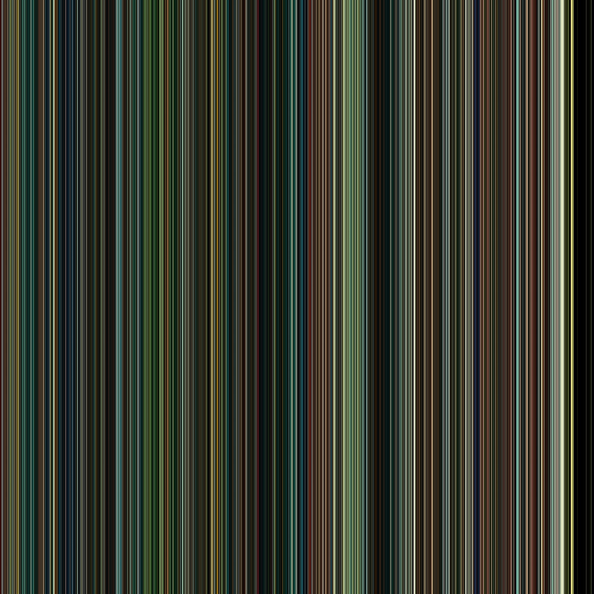
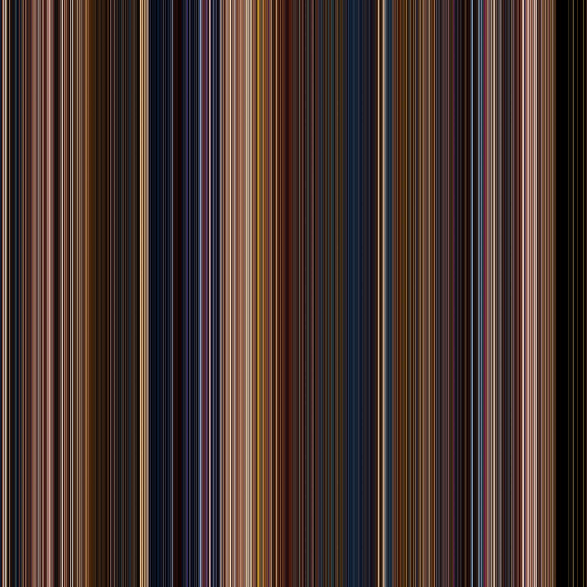
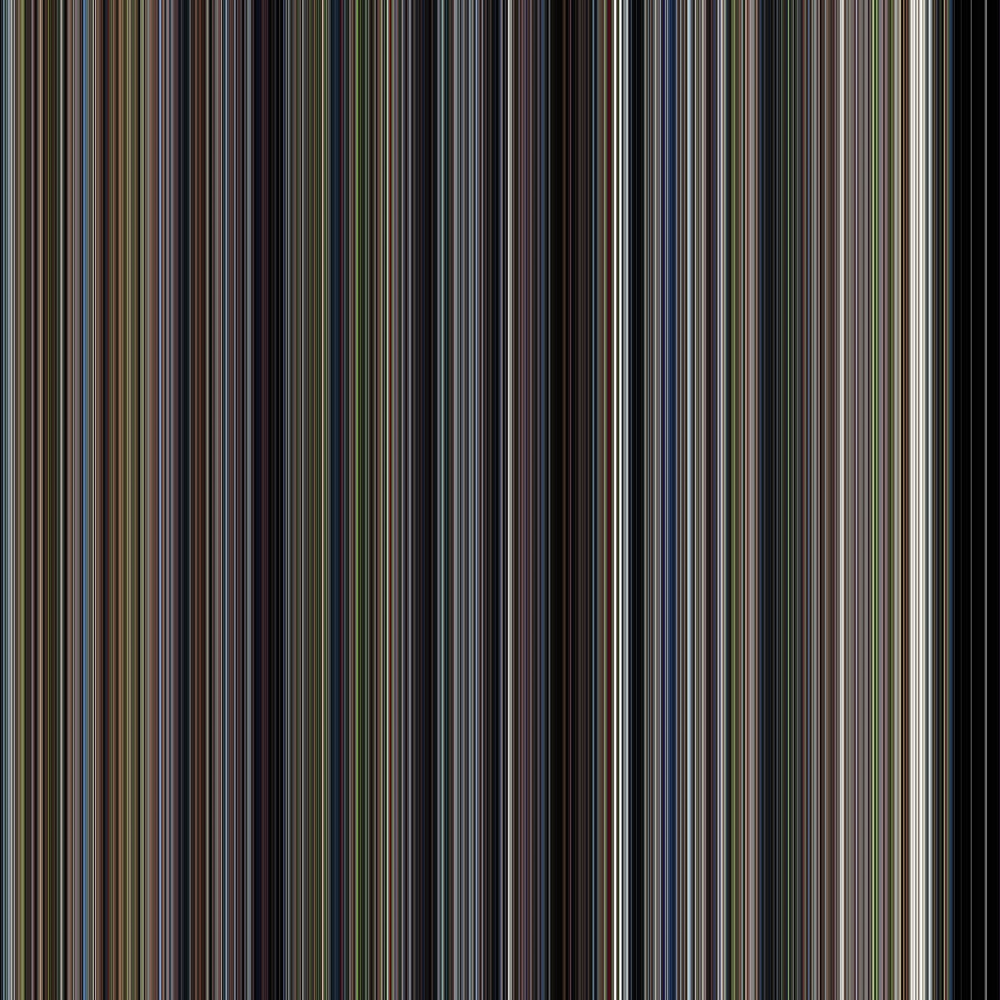
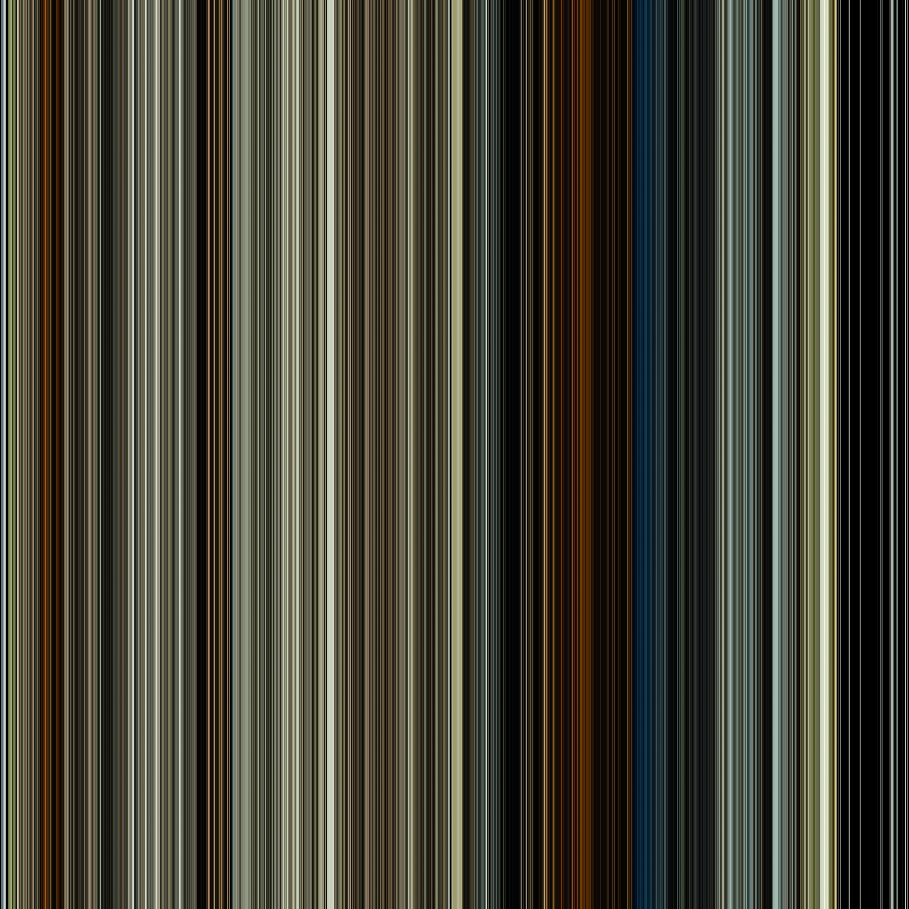
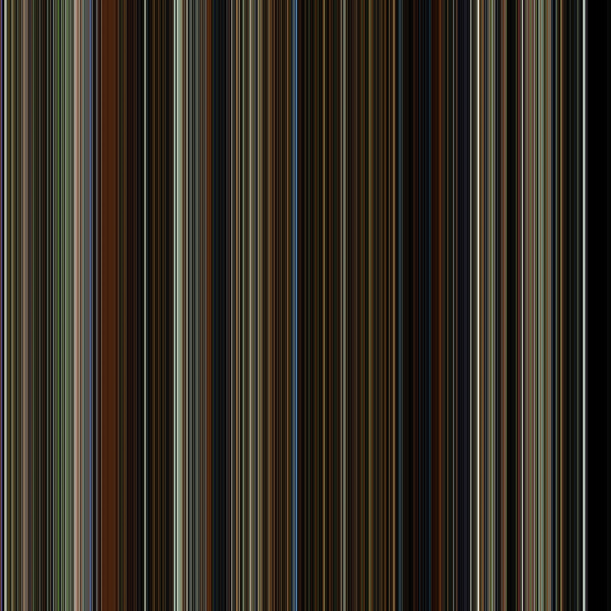
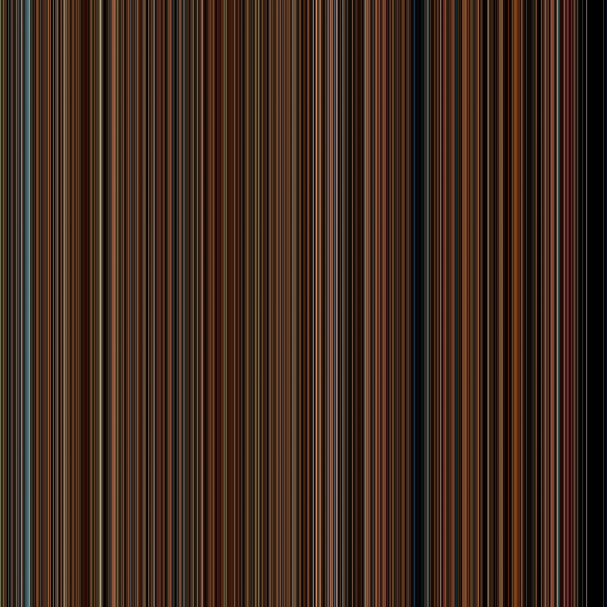
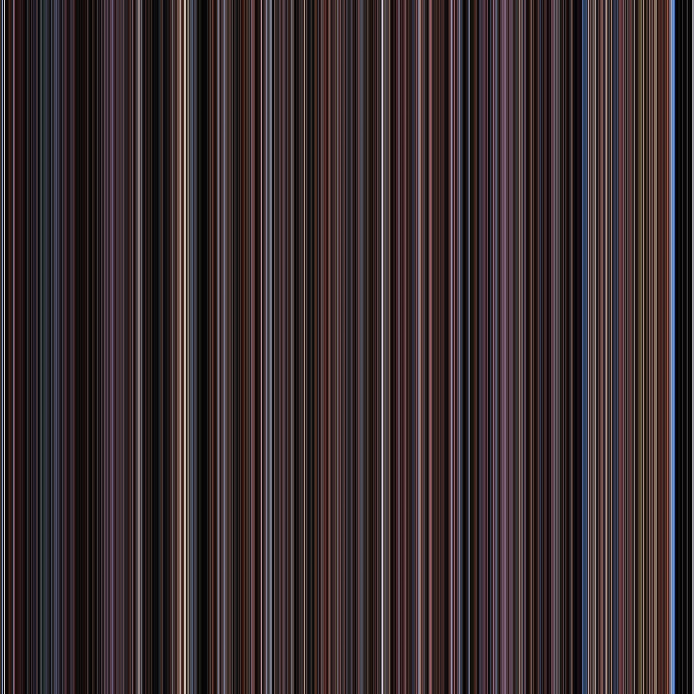

# Create linear Art picture from video file

This script take frames from video thru some interval, calculate average color of this frame and draw vertical line on the image.

Output picture have main color of the first frame on left side and main color of the last frame on rigth side.

## Start
`python imgs_from_video.py --f <video_file_name>`

## Config
To cofig this script ypu can use this flags:

`--n <output_file_name_without_extention>`

`--w <output_file_width_px>`

`--h <output_file_height_px>`

## Art pictures by movies:

#### Joker

#### Aladdin (2019)

#### Forrest Gamp

#### The Lion King (1994, cartoon)

#### 1917

#### Green Book

#### Parasite

#### The Green Mile

#### The Shawshank Redemption

